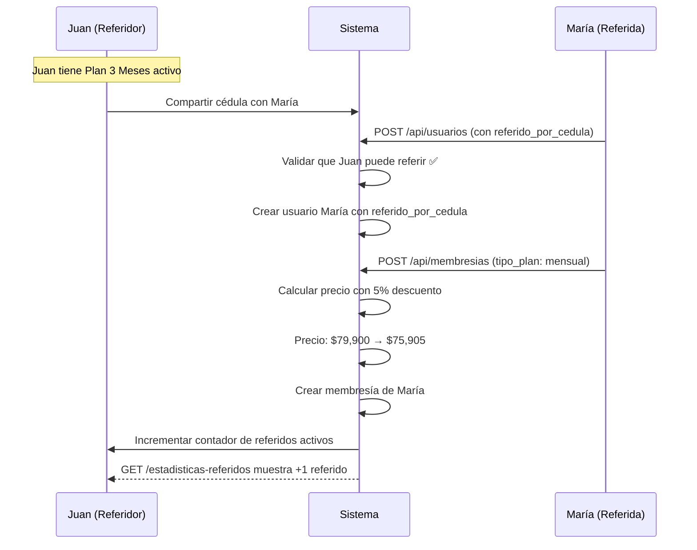

# Sistema de Referidos Completo - Documentación

## ✅ Implementación Completada

### Resumen
Sistema completo de referidos con reglas de negocio, validaciones, descuentos y beneficios para referidores y referidos.

---

## 🎯 Reglas de Negocio

### A) Quién Puede Referir

**Planes válidos para referir**:
- ✅ Mensual (30 días) - $79,900
- ✅ Plan 3 Meses (90 días) - $199,000
- ✅ Plan 6 Meses (180 días) - $349,000
- ✅ Elite Anual (365 días) - $599,000

**NO pueden referir**:
- ❌ Pase Diario (1 día) - $5,000
- ❌ Pase Flex (14 días) - $39,900

**Validación automática**:
- El sistema verifica que el referidor tenga membresía **activa**
- El sistema verifica que el plan del referidor esté en la lista de planes válidos
- Si no cumple, muestra error: "Este cliente no puede referir..."

### B) Beneficio para el Referidor

**Regla**: Por cada **3 referidos activos** → **1 mes gratis** (30 días extra)

**Ejemplos**:
- 3 referidos activos = 1 mes gratis (30 días)
- 6 referidos activos = 2 meses gratis (60 días)
- 9 referidos activos = 3 meses gratis (90 días)

**Condiciones**:
- Solo cuentan referidos con **membresía activa**
- Los días se suman a la fecha_fin de la membresía actual
- Es acumulable sin límite

### C) Beneficio para el Referido

**Regla**: **5% de descuento** en el plan que elija

**Aplicación automática**:
- Se aplica automáticamente al crear la membresía
- El precio se calcula: `precio_final = precio_base * 0.95`
- Se redondea a entero: `int(precio_base * 0.95)`

**Ejemplos de descuentos**:

| Plan Original | Precio Base | Descuento 5% | Precio Final |
|---------------|-------------|--------------|--------------|
| Pase Diario | $5,000 | -$250 | $4,750 |
| Pase Flex | $39,900 | -$1,995 | $37,905 |
| Mensual | $79,900 | -$3,995 | $75,905 |
| Plan 3 Meses | $199,000 | -$9,950 | $189,050 |
| Plan 6 Meses | $349,000 | -$17,450 | $331,550 |
| Elite Anual | $599,000 | -$29,950 | $569,050 |

---

## 🔧 Implementación Backend

### 1. Configuración de Planes

**Archivo**: `backend/app/modules/usuarios/models/membresia.py`

```python
# Configuración de planes con precios y duración
PLANES_CONFIG = {
    TipoPlan.PASE_DIARIO: {"nombre": "Pase Diario", "precio": 5000, "dias": 1, "puede_referir": False},
    TipoPlan.PASE_FLEX: {"nombre": "Pase Flex", "precio": 39900, "dias": 14, "puede_referir": False},
    TipoPlan.MENSUAL: {"nombre": "Mensual", "precio": 79900, "dias": 30, "puede_referir": True},
    TipoPlan.PLAN_3_MESES: {"nombre": "Plan 3 Meses", "precio": 199000, "dias": 90, "puede_referir": True},
    TipoPlan.PLAN_6_MESES: {"nombre": "Plan 6 Meses", "precio": 349000, "dias": 180, "puede_referir": True},
    TipoPlan.ELITE_ANUAL: {"nombre": "Elite Anual", "precio": 599000, "dias": 365, "puede_referir": True},
}

# Planes válidos para referir (solo planes largos)
PLANES_VALIDOS_REFERIR = [
    TipoPlan.MENSUAL,
    TipoPlan.PLAN_3_MESES,
    TipoPlan.PLAN_6_MESES,
    TipoPlan.ELITE_ANUAL,
]

# Configuración del sistema de referidos
REFERIDOS_CONFIG = {
    "referidos_por_mes_gratis": 3,  # Cada 3 referidos activos = 1 mes gratis
    "dias_por_recompensa": 30,  # 30 días por cada recompensa
    "descuento_referido": 0.05,  # 5% de descuento para el referido
}
```

### 2. Funciones CRUD

**Archivo**: `backend/app/crud/usuarios.py`

#### 2.1 Validar si puede referir

```python
def puede_referir(db: Session, cedula: str) -> bool:
    """
    Verifica si un usuario puede referir a otros.
    Reglas: Solo clientes con planes Mensual, Plan 3 Meses, Plan 6 Meses, Elite Anual
    """
    usuario = get_usuario_by_cedula(db, cedula)
    if not usuario:
        return False

    # Buscar membresía activa del usuario
    now = datetime.utcnow()
    membresia_activa = db.query(Membresia).filter(
        and_(
            Membresia.usuario_id == usuario.id,
            Membresia.activo == True,
            Membresia.estado == EstadoMembresia.ACTIVA,
            Membresia.fecha_fin >= now
        )
    ).first()

    if not membresia_activa:
        return False

    # Verificar si el plan permite referir
    return membresia_activa.tipo_plan in PLANES_VALIDOS_REFERIR
```

#### 2.2 Contar referidos activos

```python
def contar_referidos_activos(db: Session, cedula_referidor: str) -> int:
    """
    Cuenta cuántos referidos activos tiene un usuario.
    Solo cuentan referidos con membresía activa.
    """
    # Buscar todos los usuarios referidos por esta cédula
    referidos = db.query(Usuario).filter(Usuario.referido_por_cedula == cedula_referidor).all()

    count = 0
    now = datetime.utcnow()

    for referido in referidos:
        # Verificar si tiene membresía activa
        membresia_activa = db.query(Membresia).filter(
            and_(
                Membresia.usuario_id == referido.id,
                Membresia.activo == True,
                Membresia.estado == EstadoMembresia.ACTIVA,
                Membresia.fecha_fin >= now
            )
        ).first()

        if membresia_activa:
            count += 1

    return count
```

#### 2.3 Obtener estadísticas de referidos

```python
def get_estadisticas_referidos(db: Session, cedula: str) -> dict:
    """
    Obtiene estadísticas de referidos de un usuario.
    """
    usuario = get_usuario_by_cedula(db, cedula)
    if not usuario:
        return {"error": "Usuario no encontrado"}

    puede_ref = puede_referir(db, cedula)
    referidos_activos = contar_referidos_activos(db, cedula)
    meses_ganados = referidos_activos // 3
    referidos_para_proximo = 3 - (referidos_activos % 3)

    return {
        "usuario_id": usuario.id,
        "nombre_completo": f"{usuario.nombre} {usuario.apellido}",
        "puede_referir": puede_ref,
        "referidos_activos": referidos_activos,
        "meses_gratis_ganados": meses_ganados,
        "referidos_para_proximo_mes": referidos_para_proximo if puede_ref else 0,
    }
```

### 3. Aplicar Descuento 5% al Crear Membresía

**Archivo**: `backend/app/crud/membresias.py`

```python
def create_membresia_simple(db: Session, membresia_simple: MembresiaCreateSimple) -> Membresia:
    """
    Crea una membresía con auto-cálculo de precio, duración y fechas.
    Desactiva automáticamente membresías anteriores del usuario.
    Aplica descuento del 5% si el usuario fue referido.
    """
    # 1. Obtener configuración del plan
    config_plan = PLANES_CONFIG.get(membresia_simple.tipo_plan)
    if not config_plan:
        raise ValueError(f"Plan no válido: {membresia_simple.tipo_plan}")

    # 2. Desactivar membresías anteriores del usuario
    desactivar_membresias_anteriores(db, membresia_simple.usuario_id)

    # 3. Calcular precio (con descuento si fue referido)
    precio_base = config_plan["precio"]
    usuario = db.query(Usuario).filter(Usuario.id == membresia_simple.usuario_id).first()

    # Si fue referido, aplicar descuento del 5%
    if usuario and usuario.referido_por_cedula:
        descuento = REFERIDOS_CONFIG["descuento_referido"]
        precio_final = int(precio_base * (1 - descuento))
    else:
        precio_final = precio_base

    # 4. Calcular fechas
    fecha_inicio = datetime.utcnow()
    fecha_fin = Membresia.calcular_fecha_fin(fecha_inicio, config_plan["dias"])

    # 5. Crear membresía completa
    membresia_data = MembresiaCreate(
        usuario_id=membresia_simple.usuario_id,
        tipo_plan=membresia_simple.tipo_plan,
        precio=precio_final,
        duracion_dias=config_plan["dias"],
        fecha_inicio=fecha_inicio,
        fecha_fin=fecha_fin,
        descripcion=membresia_simple.descripcion
    )

    # 6. Guardar en BD
    db_membresia = Membresia(**membresia_data.model_dump())
    db.add(db_membresia)
    db.commit()
    db.refresh(db_membresia)

    return db_membresia
```

### 4. Endpoints de API

**Archivo**: `backend/app/api/endpoints/usuarios.py`

#### 4.1 Buscar usuario y validar si puede referir

```python
@router.get("/buscar-cedula/{cedula}", response_model=schemas.UsuarioBusqueda)
def buscar_usuario_por_cedula(cedula: str, db: Session = Depends(get_db)):
    """
    Busca un usuario por su cédula (campo telefono).
    Retorna información básica del usuario si existe.
    Valida si el usuario puede referir a otros (solo planes largos).
    """
    db_usuario = crud.get_usuario_by_cedula(db, cedula=cedula)
    if db_usuario is None:
        raise HTTPException(
            status_code=status.HTTP_404_NOT_FOUND,
            detail="Usuario no encontrado con esa cédula"
        )

    # Verificar si puede referir
    puede_ref = crud.puede_referir(db, cedula)
    if not puede_ref:
        raise HTTPException(
            status_code=status.HTTP_400_BAD_REQUEST,
            detail="Este cliente no puede referir. Solo clientes con planes Mensual, 3 Meses, 6 Meses o Elite Anual pueden referir."
        )

    return db_usuario
```

#### 4.2 Obtener estadísticas de referidos

```python
@router.get("/estadisticas-referidos/{cedula}")
def obtener_estadisticas_referidos(cedula: str, db: Session = Depends(get_db)):
    """
    Obtiene estadísticas de referidos de un usuario.
    - Referidos activos
    - Meses gratis ganados
    - Referidos que faltan para el próximo mes gratis
    """
    estadisticas = crud.get_estadisticas_referidos(db, cedula)
    if "error" in estadisticas:
        raise HTTPException(
            status_code=status.HTTP_404_NOT_FOUND,
            detail=estadisticas["error"]
        )
    return estadisticas
```

---

## 🧪 Cómo Probar

### Caso 1: Verificar que un usuario puede referir

**Requisitos**:
- Usuario con cédula válida
- Membresía activa de tipo Mensual, 3 Meses, 6 Meses o Elite Anual

**Endpoint**: `GET /api/usuarios/buscar-cedula/{cedula}`

**Request**:
```bash
curl http://localhost:8000/api/usuarios/buscar-cedula/3122502394
```

**Response exitosa (200)**:
```json
{
    "id": 1,
    "nombre": "Osne",
    "apellido": "montoya",
    "telefono": "3122502394"
}
```

**Response error si NO puede referir (400)**:
```json
{
    "detail": "Este cliente no puede referir. Solo clientes con planes Mensual, 3 Meses, 6 Meses o Elite Anual pueden referir."
}
```

### Caso 2: Obtener estadísticas de referidos

**Endpoint**: `GET /api/usuarios/estadisticas-referidos/{cedula}`

**Request**:
```bash
curl http://localhost:8000/api/usuarios/estadisticas-referidos/3122502394
```

**Response (200)**:
```json
{
    "usuario_id": 1,
    "nombre_completo": "Osne montoya",
    "puede_referir": true,
    "referidos_activos": 2,
    "meses_gratis_ganados": 0,
    "referidos_para_proximo_mes": 1
}
```

**Interpretación**:
- **puede_referir**: true → Tiene plan válido para referir
- **referidos_activos**: 2 → Tiene 2 referidos con membresía activa
- **meses_gratis_ganados**: 0 → Aún no alcanza 3 referidos para el primer mes gratis
- **referidos_para_proximo_mes**: 1 → Le falta 1 referido para ganar 1 mes gratis

### Caso 3: Crear usuario con referido y verificar descuento

**Paso 1: Crear usuario referido**:
```bash
curl -X POST http://localhost:8000/api/usuarios/ \
  -H "Content-Type: application/json" \
  -d '{
    "nombre": "Nuevo",
    "apellido": "Referido",
    "email": "nuevo@example.com",
    "telefono": "3001234567",
    "tipo": "cliente",
    "referido_por_cedula": "3122502394"
  }'
```

**Paso 2: Crear membresía para el referido**:
```bash
curl -X POST http://localhost:8000/api/membresias/ \
  -H "Content-Type: application/json" \
  -d '{
    "usuario_id": [ID_DEL_USUARIO_CREADO],
    "tipo_plan": "mensual",
    "descripcion": "Primera membresía"
  }'
```

**Paso 3: Verificar precio con descuento**:
```bash
curl http://localhost:8000/api/membresias/usuario/[ID_DEL_USUARIO_CREADO]
```

**Verificación**:
- **Precio esperado**: $75,905 (5% descuento de $79,900)
- El campo `referido_por_cedula` debe estar en "3122502394"

### Caso 4: Verificar incremento de referidos activos del referidor

Después de crear el referido con membresía activa:

```bash
curl http://localhost:8000/api/usuarios/estadisticas-referidos/3122502394
```

**Response**:
```json
{
    "usuario_id": 1,
    "nombre_completo": "Osne montoya",
    "puede_referir": true,
    "referidos_activos": 3,
    "meses_gratis_ganados": 1,
    "referidos_para_proximo_mes": 3
}
```

**Ahora**:
- **referidos_activos**: 3 → Alcanzó los 3 referidos
- **meses_gratis_ganados**: 1 → Ganó 1 mes gratis (30 días)
- **referidos_para_proximo_mes**: 3 → Necesita 3 más para el siguiente mes

---

## 📊 Flujo Completo de Referidos

### Escenario: Juan refiere a María



---

## 🎁 Beneficios Acumulables

### Para el Referidor

| Referidos Activos | Meses Gratis Ganados | Días Extra Totales |
|-------------------|----------------------|--------------------|
| 0-2 | 0 | 0 |
| 3-5 | 1 | 30 |
| 6-8 | 2 | 60 |
| 9-11 | 3 | 90 |
| 12-14 | 4 | 120 |
| 15-17 | 5 | 150 |
| ... | ... | ... |

### Para el Referido

**Siempre**: 5% de descuento en el primer plan que elija

---

## 📁 Archivos Modificados/Creados

### Backend (6 archivos)
1. ✅ [backend/app/modules/usuarios/models/membresia.py](backend/app/modules/usuarios/models/membresia.py) - Configuración y constantes
2. ✅ [backend/app/crud/usuarios.py](backend/app/crud/usuarios.py) - Funciones de validación y estadísticas
3. ✅ [backend/app/crud/membresias.py](backend/app/crud/membresias.py) - Aplicación de descuento
4. ✅ [backend/app/api/endpoints/usuarios.py](backend/app/api/endpoints/usuarios.py) - Endpoints de referidos
5. ✅ [backend/app/modules/usuarios/models/usuario.py](backend/app/modules/usuarios/models/usuario.py) - Campo referido_por_cedula
6. ✅ [backend/app/schemas/usuario.py](backend/app/schemas/usuario.py) - Schemas actualizados

### Frontend (3 archivos)
7. ✅ [types/index.ts](types/index.ts) - Types de referidos
8. ✅ [lib/services/usuarios.ts](lib/services/usuarios.ts) - Servicio de búsqueda
9. ✅ [components/new-client-drawer.tsx](components/new-client-drawer.tsx) - Campo de referido

### Documentación (3 archivos)
10. ✅ [SISTEMA_REFERIDOS_COMPLETO.md](SISTEMA_REFERIDOS_COMPLETO.md) - Esta documentación
11. ✅ [FUNCIONALIDAD_REFERIDOS.md](FUNCIONALIDAD_REFERIDOS.md) - Documentación básica
12. ✅ [VERIFICACION_FECHA_FIN.md](VERIFICACION_FECHA_FIN.md) - Documentación fecha fin

---

## 🔒 Validaciones Implementadas

### ✅ Backend
- [x] Solo usuarios con planes válidos pueden referir
- [x] Membresía del referidor debe estar activa
- [x] Solo se cuentan referidos con membresía activa
- [x] Descuento del 5% se aplica automáticamente
- [x] Precio se calcula correctamente con descuento

### ✅ Frontend
- [x] Campo visible solo para clientes
- [x] Búsqueda en tiempo real con debounce
- [x] Validación visual del referidor
- [x] Mensaje de error si no puede referir
- [x] Campo opcional, no bloquea registro

---

## 💡 Notas Técnicas

### Cálculo de Descuento
```python
precio_base = 79900
descuento = 0.05
precio_final = int(precio_base * (1 - descuento))
# precio_final = int(79900 * 0.95) = int(75905.0) = 75905
```

### Cálculo de Meses Ganados
```python
referidos_activos = 7
meses_ganados = referidos_activos // 3  # División entera
# meses_ganados = 7 // 3 = 2

referidos_para_proximo = 3 - (referidos_activos % 3)
# referidos_para_proximo = 3 - (7 % 3) = 3 - 1 = 2
```

### Solo Cuentan Referidos Activos
Un referido cuenta como "activo" si cumple **TODAS** estas condiciones:
1. Tiene el campo `referido_por_cedula` lleno
2. Tiene una membresía con `activo = True`
3. Membresía con `estado = ACTIVA`
4. `fecha_fin >= fecha_actual`

---

## 🚀 Estado del Sistema

### ✅ Completado
- [x] Modelo de datos con campo referido_por_cedula
- [x] Validación de planes válidos para referir
- [x] Endpoint de búsqueda con validación
- [x] Endpoint de estadísticas de referidos
- [x] Aplicación automática de descuento 5%
- [x] Contador de referidos activos
- [x] Cálculo de meses gratis ganados
- [x] Frontend con campo de referido
- [x] Búsqueda en tiempo real
- [x] Validación visual en el formulario

### 🔄 Para Implementar Después (Opcional)
- [ ] Función automática para aplicar meses gratis al referidor
- [ ] Dashboard de referidos en el panel del usuario
- [ ] Notificaciones al referidor cuando gana meses
- [ ] Historial de referidos por usuario
- [ ] Reporte de referidos del gimnasio
- [ ] Códigos de referido únicos por usuario

---

## ✨ Conclusión

El sistema de referidos está **completamente funcional** con todas las reglas de negocio implementadas:

- ✅ Validación de quién puede referir (solo planes largos)
- ✅ Descuento automático del 5% para referidos
- ✅ Contador de referidos activos
- ✅ Cálculo de meses gratis (cada 3 referidos = 1 mes)
- ✅ Endpoints de API para estadísticas
- ✅ Frontend integrado con validación

**Listo para usar en producción**.
